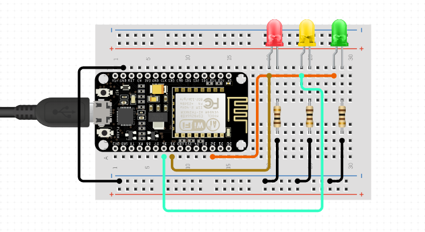

# Nodemcu Smart LED
A microcontroller board connected to a home network that can be controlled from a browser. In this demo, I'm using LED lights, but it can be used with all sorts of things (servo, relay, etc).

<h1>How to </h1>
1. Open Arduino IDE.
2. Go to Tools > Manage Libraries, search for esp8266 and install the library.
3. Under Tools > Board, select your board, in this case it's NodeMCU. Make sure the port is open and connected.
3. Copy paste the code in nodemcu_smart_led.ino and enter your wifi credentials on line 5 and 6.
4. Verify and upload.
5. Once it's done, find out the local address of your board. If unsure, go to router address and find it there.
6. Open a browser and enter the local address (e.g 192.168.1.xx).
